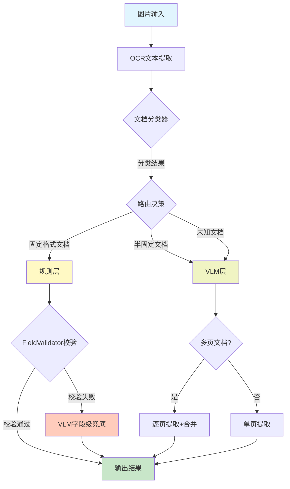

# OCR三层混合架构 - 技术架构文档

## 目录

1. [项目概述](#项目概述)
2. [整体架构设计](#整体架构设计)
3. [核心模块详解](#核心模块详解)
4. [关键技术说明](#关键技术说明)
5. [依赖关系](#依赖关系)
6. [配置文件说明](#配置文件说明)
7. [测试体系](#测试体系)

---

## 项目概述

### 架构演进

**v2.0 简化版**：
- 移除 LLM 层（PP-ChatOCRv4）
- 移除 VLM 分类兜底
- 移除 PaddleOCR-VL 备用引擎
- VLM 层增强：支持类型识别+提取、多页文档处理

### 支持的文档类型

系统支持以下文档类型的自动分类和字段提取：

**第一类：标准证件**
- 身份证（正面/背面）
- 结婚证（封面/内容页/盖章页）
- 离婚证（封面/内容页/盖章页）
- 户口本（首页/个人页）
- 不动产权证书（首页/内容页/附图页）

**第二类：标准单证**
- 发票

**第三类：合同/协议**
- 购房合同（首页/内容页/签署页）
- 存量房合同（首页/内容页/签署页）
- 资金监管协议（首页/信息页/签章页）
- 资金监管凭证
- 离婚协议书
- 公证书
- 委托书

---

## 整体架构设计

### 三层架构设计

```
┌─────────────────────────────────────────────────────────────────┐
│                    OCR三层混合架构 v2.0                          │
├─────────────────────────────────────────────────────────────────┤
│                                                                 │
│  ┌──────────────────────────────────────────────────────────┐   │
│  │ 第1层: 文档分类器 (Document Classifier)                   │   │
│  │                                                          │   │
│  │ 输入: 图片路径 + OCR文本                                  │   │
│  │ 输出: DocumentInfo (doc_type, page_type, confidence)     │   │
│  │                                                          │   │
│  │ 实现: KeywordDocumentClassifier                           │   │
│  │  - 阶段0: 多文档冲突检测                                   │   │
│  │  - 阶段1: 标准证件强信号                                   │   │
│  │  - 阶段1.5: 备选强信号                                    │   │
│  │  - 阶段1.6: 更多备选信号                                  │   │
│  │  - 阶段2: 标准单证强信号                                   │   │
│  │  - 阶段3: 合同字段组合                                    │   │
│  │  - 阶段4: VLM兜底                                        │   │
│  └──────────────────────────────────────────────────────────┘   │
│                              │                                   │
│                              ▼                                   │
│  ┌──────────────────────────────────────────────────────────┐   │
│  │ 第2A层: 规则层 (Rule Extraction Layer)                    │   │
│  │                                                          │   │
│  │ 适用: 固定格式文档                                        │   │
│  │  - 身份证、结婚证、离婚证                                  │   │
│  │  - 户口本、房产证                                         │   │
│  │  - 发票                                                   │   │
│  │                                                          │   │
│  │ 技术: 正则表达式 + 位置标注提取                            │   │
│  │  - PersonalIdExtractor                                   │   │
│  │  - HouseholdPropertyExtractor (支持PaddleOCR坐标)         │   │
│  │  - FinancialExtractor                                    │   │
│  │  - AgreementExtractor                                    │   │
│  └──────────────────────────────────────────────────────────┘   │
│                              │                                   │
│                              ▼                                   │
│  ┌──────────────────────────────────────────────────────────┐   │
│  │ 第2B层: VLM层 (VLM Extraction Layer)                      │   │
│  │                                                          │   │
│  │ 适用: 半固定文档 / 规则层失败兜底                          │   │
│  │  - 离婚证、购房合同、存量房合同                            │   │
│  │  - 房产证、资金监管协议                                    │   │
│  │  - UNKNOWN文档                                           │   │
│  │                                                          │   │
│  │ 技术: 视觉语言模型 (GLM-OCR / Qwen2.5-VL-7B)              │   │
│  │  - 专用Prompt模板 (按文档类型)                             │   │
│  │  - 多页文档合并                                            │   │
│  └──────────────────────────────────────────────────────────┘   │
│                              │                                   │
│                              ▼                                   │
│  ┌──────────────────────────────────────────────────────────┐   │
│  │ 第3层: VLM字段级兜底 (VLM Fallback)                       │   │
│  │                                                          │   │
│  │ 触发条件: 规则层字段校验失败                               │   │
│  │ 流程: FieldValidator校验 → 失败字段 → VLM重新提取         │   │
│  │                                                          │   │
│  │ 启用文档: 户口本、结婚证、身份证                            │   │
│  └──────────────────────────────────────────────────────────┘   │
│                                                                 │
└─────────────────────────────────────────────────────────────────┘
```

### 数据流向图



### Pipeline编排流程

```
Pipeline.process()
├── 1. 文档分类 (KeywordDocumentClassifier)
│   ├── 获取 DocumentInfo (doc_type, page_type, confidence)
│   └── 记录分类元数据 (route, signal)
│
├── 2. 选择处理层
│   ├── RULE层: RuleExtractionLayer
│   └── VLM层: VLMExtractionLayer
│
├── 3. 字段提取
│   ├── 规则层: 正则表达式匹配
│   └── VLM层: 调用VLM API提取
│
├── 4. VLM字段级兜底 (可选)
│   ├── FieldValidator校验
│   └── 失败字段 → VLM重新提取
│
└── 5. 返回 ExtractionResult
```

---

## 核心模块详解

### 1. `interfaces.py` - 接口定义

**文件路径**: `/Users/dongsun/Github/OCR-Three-Layer-Hybrid/src/ocr_three_layer_hybrid/interfaces.py`

#### 枚举类型

```python
class DocumentType(str, Enum):
    """支持的文档类型"""
    # 第一类：标准证件
    ID_CARD = "身份证"
    ID_CARD_FRONT = "身份证-正面"
    ID_CARD_BACK = "身份证-背面"
    MARRIAGE_CERTIFICATE = "结婚证"
    # ... 更多类型

class PageType(str, Enum):
    """页面类型"""
    COVER = "封面页"
    CONTENT = "内容页"
    STAMP = "盖章页"
    ATTACHMENT = "附件页"
    FIRST_PAGE = "首页"
    PERSONAL_PAGE = "个人页"
    BACK = "封底页"
    UNKNOWN = "未知页"

class ProcessingLayer(str, Enum):
    """处理层类型"""
    RULE = "rule"
    VLM = "vlm"
    LLM = "llm"
```

#### 数据类

```python
@dataclass
class DocumentInfo:
    """文档信息"""
    image_path: str
    doc_type: DocumentType = DocumentType.UNKNOWN
    page_type: PageType = PageType.UNKNOWN
    ocr_texts: List[str] = field(default_factory=list)
    confidence: float = 0.0
    metadata: Dict[str, Any] = field(default_factory=dict)

    def should_extract(self) -> bool:
        """是否需要进行字段提取（封面页、封底页跳过）"""
        return self.page_type not in [PageType.COVER, PageType.BACK]

@dataclass
class ExtractionResult:
    """字段提取结果"""
    doc_type: DocumentType
    layer: ProcessingLayer
    fields: Dict[str, str] = field(default_factory=dict)
    success: bool = True
    time_cost: float = 0.0
    error_message: str = ""
    raw_text: str = ""
    vlm_fallback_triggered: bool = False
    vlm_fallback_fields: List[str] = field(default_factory=list)
    field_conflicts: List[FieldConflict] = field(default_factory=list)
```

#### 抽象接口

```python
class IDocumentClassifier(ABC):
    """文档分类器接口"""
    @abstractmethod
    def classify(self, image_path: str, ocr_texts: List[str]) -> DocumentInfo:
        pass

class IExtractionLayer(ABC):
    """字段提取层接口"""
    @property
    @abstractmethod
    def supported_doc_types(self) -> List[DocumentType]:
        pass

    @abstractmethod
    def can_process(self, doc_info: DocumentInfo) -> bool:
        pass

    @abstractmethod
    def extract(self, doc_info: DocumentInfo, key_list: List[str]) -> ExtractionResult:
        pass
```

---

### 2. `classifier.py` - 文档分类器

**文件路径**: `/Users/dongsun/Github/OCR-Three-Layer-Hybrid/src/ocr_three_layer_hybrid/classifier.py`

#### 三阶段路由策略

**阶段0: 多文档冲突检测**
```python
# 当合同级强信号同时存在时，优先分类为合同
if has_buyer and has_seller and has_property_type:
    return DocumentType.PURCHASE_CONTRACT or DocumentType.STOCK_CONTRACT
```

**阶段1: 标准证件强信号**
```python
STANDARD_CERTIFICATE_SIGNALS = {
    DocumentType.HOUSEHOLD_REGISTER: ["常住人口登记卡"],
    DocumentType.ID_CARD: ["公民身份号码", "签发机关"],
    DocumentType.MARRIAGE_CERTIFICATE: ["结婚证字号"],
    # ...
}
```

**阶段1.5-1.6: 备选信号**
```python
BACKUP_CERTIFICATE_SIGNALS = {
    DocumentType.MARRIAGE_CERTIFICATE: {
        "primary": ["持证人"],
        "required": ["登记日期"],
    },
    # ...
}
```

**阶段2: 标准单证**
```python
# 发票：发票代码 + 发票号码同时存在
if all(signal in full_text for signal in ["发票代码", "发票号码"]):
    return DocumentType.INVOICE
```

**阶段3: 合同字段组合**
```python
# 买卖合同：买受人 + 出卖人 + 价款
CONTRACT_BUYER_KEYWORDS = ["买受人", "买方", "乙方"]
CONTRACT_SELLER_KEYWORDS = ["出卖人", "卖方", "甲方"]
```

#### 页面类型识别

```python
def _detect_page_type(self, doc_type: DocumentType, full_text: str) -> PageType:
    """根据文档类型和文本识别页面类型"""
    if doc_type == DocumentType.DIVORCE_CERTIFICATE:
        return self._detect_divorce_certificate_page_type(full_text)
    elif doc_type == DocumentType.HOUSEHOLD_REGISTER:
        return self._detect_household_register_page_type(full_text)
    # ...

# 细化文档类型
def _get_refined_doc_type(self, doc_type: DocumentType, page_type: PageType) -> DocumentType:
    """将基础类型细化为具体页面类型"""
    if doc_type == DocumentType.MARRIAGE_CERTIFICATE:
        if page_type == PageType.COVER:
            return DocumentType.MARRIAGE_CERTIFICATE_COVER
        elif page_type == PageType.CONTENT:
            return DocumentType.MARRIAGE_CERTIFICATE_CONTENT
```

---

### 3. `rule_layer.py` - 规则提取层

**文件路径**: `/Users/dongsun/Github/OCR-Three-Layer-Hybrid/src/ocr_three_layer_hybrid/rule_layer.py`

#### 提取器模块结构

```
extractors/
├── __init__.py
├── base_extractor.py              # 基础提取器
├── personal_id_extractor.py       # 身份证、结婚证、离婚证
├── household_property_extractor.py # 户口本、房产证
├── financial_extractor.py         # 发票、合同、资金监管
└── agreement_extractor.py         # 离婚协议书等
```

#### 路由逻辑

```python
def extract(self, doc_info: DocumentInfo, key_list: List[str]) -> ExtractionResult:
    if doc_info.doc_type in [ID_CARD, ID_CARD_FRONT]:
        fields = self._personal_id_extractor.extract_id_card(full_text, key_list)
    elif doc_info.doc_type in [HOUSEHOLD_REGISTER, HOUSEHOLD_REGISTER_COVER]:
        fields = self._household_property_extractor.extract_household_register(...)
    elif doc_info.doc_type == DocumentType.INVOICE:
        fields = self._financial_extractor.extract_invoice(full_text, key_list)
    elif doc_info.doc_type in [PURCHASE_CONTRACT, STOCK_CONTRACT]:
        fields = self._financial_extractor.extract_contract(...)
    # ...
```

#### 封面页处理

```python
# 封面页和盖章页直接返回空字段
if doc_info.doc_type in [
    DocumentType.DIVORCE_CERTIFICATE_COVER,
    DocumentType.MARRIAGE_CERTIFICATE_STAMP,
]:
    return ExtractionResult(fields={k: "" for k in key_list}, success=True)
```

---

### 4. `vlm_layer.py` - VLM提取层

**文件路径**: `/Users/dongsun/Github/OCR-Three-Layer-Hybrid/src/ocr_three_layer_hybrid/vlm_layer.py`

#### 支持的模型

- **GLM-OCR-Q8_0** (端口8080): 默认模型，906MB
- **Qwen2.5-VL-7B** (端口8082): 备选模型，理解能力更强

#### Prompt模板设计

```python
PROMPT_TEMPLATES = {
    DocumentType.HOUSEHOLD_REGISTER: (
        "你是一名专业的户口本页页信息提取专家...\n"
        "## 输出JSON格式\n"
        "{\n"
        '  "姓名": "",\n'
        '  "户主": "",\n'
        '  "与户主关系": "",\n'
        '  ...\n'
        "}\n"
    ),
    # 每个文档类型都有专用模板
}
```

#### 多页文档处理

```python
def extract_multi_page(self, image_paths: List[str], key_list: List[str], 
                       doc_type: DocumentType, max_pages: int = 15) -> ExtractionResult:
    """逐页提取 + 字段合并"""
    merged_fields = {k: "" for k in key_list}
    
    for img_path in image_paths[:max_pages]:
        vlm_response = self._call_vlm(prompt, img_path)
        page_fields = self._parse_json_response(vlm_response, key_list)
        
        # 合并字段（取第一个非空值）
        for key, value in page_fields.items():
            if value and value.strip() and not merged_fields.get(key):
                merged_fields[key] = value
    
    return ExtractionResult(fields=merged_fields, success=True)
```

---

### 5. `pipeline.py` - 流程编排

**文件路径**: `/Users/dongsun/Github/OCR-Three-Layer-Hybrid/src/ocr_three_layer_hybrid/pipeline.py`

#### 默认字段列表

```python
DEFAULT_KEY_LISTS = {
    DocumentType.ID_CARD: [
        "姓名", "性别", "民族", "出生", "住址", "公民身份号码",
    ],
    DocumentType.HOUSEHOLD_REGISTER: [
        "户主姓名", "户号", "住址", "姓名", "与户主关系", "性别", "公民身份号码",
    ],
    DocumentType.PURCHASE_CONTRACT: [
        "合同编号", "买受人", "出卖人", "总价款", "签订日期", "房屋地址", "建筑面积",
    ],
    # ...
}
```

#### 默认层路由

```python
DEFAULT_LAYER_ROUTING = {
    DocumentType.ID_CARD: ProcessingLayer.RULE,
    DocumentType.HOUSEHOLD_REGISTER: ProcessingLayer.RULE,
    DocumentType.PURCHASE_CONTRACT: ProcessingLayer.RULE,  # v2.0: 规则层优先
    DocumentType.UNKNOWN: ProcessingLayer.VLM,
}
```

#### VLM字段级兜底

```python
def _apply_vlm_fallback(self, image_path: str, result: ExtractionResult, 
                        doc_info: DocumentInfo) -> ExtractionResult:
    """对提取结果进行校验，失败字段触发VLM兜底"""
    fallback_enabled_types = {
        DocumentType.HOUSEHOLD_REGISTER,
        DocumentType.MARRIAGE_CERTIFICATE,
        DocumentType.ID_CARD,
    }
    
    if doc_info.doc_type not in fallback_enabled_types:
        return result
    
    failed_fields = self.vlm_fallback_handler.get_failed_fields(result.fields)
    if failed_fields:
        vlm_fields = self.vlm_fallback_handler.fallback_extract(
            image_path, failed_fields, doc_info.doc_type
        )
        # 合并VLM结果（只覆盖失败字段）
        for field_name in failed_fields:
            if vlm_fields.get(field_name):
                result.fields[field_name] = vlm_fields[field_name]
```

---

### 6. `service.py` - 服务层

**文件路径**: `/Users/dongsun/Github/OCR-Three-Layer-Hybrid/src/ocr_three_layer_hybrid/service.py`

#### 对外API

```python
class OCRService:
    def __init__(self, config: Optional[OCRConfig] = None):
        """初始化服务"""
        self._classifier = KeywordDocumentClassifier()
        self._pipeline = PlanEPlusPipeline(...)
        self._vlm_client = VLMClient(...)
    
    def process_single(self, image_path: str, ocr_text: str = "") -> Dict[str, Any]:
        """处理单张图片"""
        
    def process_batch(self, images: List[Dict]) -> List[Dict]:
        """批量处理"""
        
    def process_directory(self, dir_path: str) -> Dict[str, Any]:
        """目录批量处理"""
        
    def run_ocr(self, image_path: str) -> str:
        """纯OCR文本提取"""
```

#### 返回结果结构

```python
{
    "classification": {
        "doc_type": "购房合同",
        "confidence": 0.85,
        "route": "contract_field_combination",
        "signal": "商品房",
    },
    "extraction": {
        "success": True,
        "layer": "rule",
        "fields": {"合同编号": "...", "买受人": "..."},
        "vlm_fallback_triggered": False,
    },
    "pipeline_flow": {
        "stages": [...],
        "active_stage": "stage3",
        "extraction_layer": "rule",
    },
    "timing": {
        "classify_ms": 12.5,
        "extract_ms": 45.2,
        "total_ms": 57.7,
    }
}
```

---

### 7. `field_config.py` - 字段配置

**文件路径**: `/Users/dongsun/Github/OCR-Three-Layer-Hybrid/src/ocr_three_layer_hybrid/field_config.py`

```python
class FieldPriority(str, Enum):
    REQUIRED = "required"  # 必须字段
    OPTIONAL = "optional"  # 可选字段

@dataclass
class FieldConfig:
    name: str
    priority: FieldPriority
    sources: List[str] = field(default_factory=list)

@dataclass
class DocumentFieldConfig:
    required_fields: List[FieldConfig]
    optional_fields: List[FieldConfig]
```

---

### 8. `field_validator.py` - 字段校验

**文件路径**: `/Users/dongsun/Github/OCR-Three-Layer-Hybrid/src/ocr_three_layer_hybrid/field_validator.py`

#### 校验规则

```python
VALIDATION_RULES = {
    "公民身份号码": {
        "pattern": r"^\d{17}[\dXx]$",
        "description": "18位身份证号",
    },
    "户号": {
        "pattern": r"^\d{5,12}$",
        "description": "5-12位数字",
    },
    "姓名": {
        "min_len": 2,
        "max_len": 5,
        "char_type": "chinese_name",
    },
}
```

---

### 9. `vlm_fallback.py` - VLM兜底

**文件路径**: `/Users/dongsun/Github/OCR-Three-Layer-Hybrid/src/ocr_three_layer_hybrid/vlm_fallback.py`

```python
class VLMFallbackHandler:
    def fallback_extract(self, image_path: str, failed_fields: List[str], 
                         doc_type: DocumentType) -> Dict[str, str]:
        """调用VLM重新提取失败字段"""
        prompt = self._build_prompt(doc_type, failed_fields)
        response = self.vlm_client.call(prompt, image_path, max_tokens=512)
        return self._parse_response(response, failed_fields)
```

---

### 10. `position_extractor.py` - 位置标注提取器

**文件路径**: `/Users/dongsun/Github/OCR-Three-Layer-Hybrid/src/ocr_three_layer_hybrid/position_extractor.py`

#### 设计原理

利用PaddleOCR输出的坐标信息，基于空间位置关系提取字段，解决：
- 列错位问题
- 标签+数据合并问题
- 长地址跨列问题

#### 核心算法

```python
class HouseholdPositionExtractor:
    def extract(self, image_path: str) -> Dict[str, str]:
        """提取户口本首页字段"""
        all_items = self._parse_ocr(image_path)  # 获取带坐标的OCR结果
        
        # 在指定Y范围内查找字段标签
        label = self._find_label(all_items, "户别", ROW1_Y, LEFT_COL_X)
        
        # 策略1a: 标签本身包含数据
        # 策略1b: 标签右侧同行搜索
        # 策略2: 直接搜索（不依赖标签）
        
        return fields
```

---

### 11. `config.py` - 配置管理

**文件路径**: `/Users/dongsun/Github/OCR-Three-Layer-Hybrid/src/ocr_three_layer_hybrid/config.py`

```python
@dataclass
class OCRConfig:
    vlm_service: VLMServiceConfig = field(default_factory=VLMServiceConfig)
    qwen_vl_service: QwenVLServiceConfig = field(default_factory=QwenVLServiceConfig)
    thresholds: ThresholdsConfig = field(default_factory=ThresholdsConfig)
    
    # VLM引擎配置
    vlm_extraction_engine: str = "qwen2_5_vl_7b"  # 提取层
    vlm_fallback_engine: str = "qwen2_5_vl_7b"    # 兜底层
    vlm_ocr_engine: str = "qwen2_5_vl_7b"         # 纯OCR
```

---

## 关键技术说明

### 1. PaddleOCR-VL-0.9B 的使用方式

**注意**: 项目中实际使用的是 **PaddleOCR** (非VL版本)，用于位置标注提取。

```python
from paddleocr import PaddleOCR

ocr = PaddleOCR(lang="ch")
results = list(ocr.predict(input=image_path))

# 输出包含:
# - rec_texts: 识别文本
# - rec_boxes: 坐标框 [x1, y1, x2, y2]
# - rec_scores: 置信度
```

**文档相对坐标归一化**:
```python
# 将图片绝对坐标转换为文档相对坐标
rx1 = (x1 - min_x) / doc_w  # 归一化到[0,1]
ry1 = (y1 - min_y) / doc_h
```

---

### 2. Qwen2.5-VL API调用方式

**服务端点**:
- GLM-OCR: `http://localhost:8080/v1`
- Qwen2.5-VL-7B: `http://localhost:8082/v1`

**启动命令**:
```bash
cd /Users/dongsun/Github/models-OCR/Qwen2.5-VL-7B && llama-server \
  --model Qwen2.5-VL-7B-Instruct-abliterated.Q4_K_M-2.gguf \
  --mmproj Qwen2.5-VL-7B-Instruct-abliterated.mmproj-Q8_0.gguf \
  --host 0.0.0.0 --port 8082 --ctx-size 8192
```

**API调用** (`external_services.py`):
```python
class VLMClient:
    def call(self, prompt: str, image_path: str, max_tokens: int = 1024) -> Any:
        # 编码图片为base64
        base64_image = encode_image_base64(image_path)
        
        # 构建消息
        messages = [
            {
                "role": "user",
                "content": [
                    {"type": "text", "text": prompt},
                    {"type": "image_url", "image_url": {"url": f"data:image/jpeg;base64,{base64_image}"}}
                ]
            }
        ]
        
        # 调用OpenAI兼容的API
        response = requests.post(f"{self.base_url}/chat/completions", json={
            "model": self.model_name,
            "messages": messages,
            "max_tokens": max_tokens,
        })
        
        return response.json()["choices"][0]["message"]["content"]
```

---

### 3. LLM集成方式

**v2.0已移除LLM层**，原计划使用qwen3.5-4B作为LLM提取层。当前架构中不涉及LLM调用。

---

### 4. 字段校验机制

**校验维度**:
1. **格式校验**: 正则表达式匹配（身份证号、户号等）
2. **长度校验**: 最小/最大长度
3. **内容校验**: 字符类型（中文姓名）、地址关键词
4. **逻辑校验**: 字段间关系（待扩展）

**校验流程**:
```
提取结果 → FieldValidator.validate_fields() → ValidationResult
                                       ↓
                              校验失败字段列表
                                       ↓
                              VLMFallbackHandler.fallback_extract()
                                       ↓
                              合并VLM结果
```

---

### 5. 多页面合并逻辑

**适用场景**: 购房合同、存量房合同、房产证等多页文档

**合并策略**:
```python
for page_idx, img_path in enumerate(image_paths):
    result = pipeline.process(img_path, ocr_texts)
    
    # 取第一个非空值
    for key, value in result.fields.items():
        if value and value.strip() and not merged_fields.get(key):
            merged_fields[key] = value

# 冲突检测
for field_name in merged_fields:
    values_by_page = {page: result.fields[field_name] for page in results}
    if len(set(values_by_page.values())) > 1:
        conflicts.append(FieldConflict(...))
```

---

### 6. 冲突检测机制

**FieldConflict数据结构**:
```python
@dataclass
class FieldConflict:
    field_name: str          # 字段名称
    source_a_value: str      # 来源A的值
    source_b_value: str      # 来源B的值
    source_a_page: str       # 来源A的页面
    source_b_page: str       # 来源B的页面
    resolved_value: str      # 解决后的值（默认取来源A）
```

**解决策略**: 优先采用第一个非空值，记录冲突供后续审计。

---

## 依赖关系

### Python依赖包

项目未提供明确的`requirements.txt`或`pyproject.toml`（位于archive目录外）。根据代码分析，主要依赖包括：

**核心依赖**:
- `paddleocr`: OCR引擎
- `pillow`: 图像处理
- `requests`: HTTP请求
- `pydantic` / `dataclasses`: 数据类

**可选依赖**:
- `pytest`: 测试框架

### 模型依赖

**GLM-OCR** (端口8080):
- 路径: `/Users/dongsun/Github/models-OCR/GLM-OCR-GGUF/`
- 文件: `GLM-OCR-Q8_0.gguf` (906MB), `mmproj-GLM-OCR-Q8_0.gguf` (462MB)

**Qwen2.5-VL-7B** (端口8082):
- 路径: `/Users/dongsun/Github/models-OCR/Qwen2.5-VL-7B/`
- 文件: `Qwen2.5-VL-7B-Instruct-abliterated.Q4_K_M-2.gguf` (4.4GB), `mmproj-Qwen2.5-VL-7B-Instruct-abliterated.mmproj-Q8_0.gguf` (814MB)

**PaddleOCR模型**:
- 自动下载或通过PaddlePaddle加载

### 服务依赖

**llama-server端口配置**:
- 8080: GLM-OCR
- 8082: Qwen2.5-VL-7B
- 8083: Qwen3.5-4B (预留)
- 8084: Qwen3.5-9B (预留)

---

## 配置文件说明

### DEFAULT_KEY_LISTS

定义各文档类型的默认提取字段：

```python
DEFAULT_KEY_LISTS = {
    DocumentType.ID_CARD: ["姓名", "性别", "民族", "出生", "住址", "公民身份号码"],
    DocumentType.HOUSEHOLD_REGISTER: ["户主姓名", "户号", "住址", "姓名", "与户主关系", "性别", "公民身份号码"],
    DocumentType.FUND_SUPERVISION: [
        "编号", "甲方", "乙方", "丙方", "签署日期",
        "甲方姓名", "甲方身份证号", "甲方银行", "甲方账号",
        ...
    ],
}
```

### DEFAULT_FIELD_CONFIGS

区分必须/可选字段：

```python
DEFAULT_FIELD_CONFIGS = {
    DocumentType.PURCHASE_CONTRACT_CONTENT: DocumentFieldConfig(
        required_fields=[
            FieldConfig(name="总价款", priority=FieldPriority.REQUIRED),
            FieldConfig(name="签订日期", priority=FieldPriority.REQUIRED),
            FieldConfig(name="建筑面积", priority=FieldPriority.REQUIRED),
        ],
        optional_fields=[
            FieldConfig(name="合同编号", priority=FieldPriority.OPTIONAL),
            ...
        ]
    ),
}
```

### 分类规则配置

位于`classifier.py`中的常量：

```python
STANDARD_CERTIFICATE_SIGNALS = {...}
BACKUP_CERTIFICATE_SIGNALS = {...}
ADDITIONAL_BACKUP_SIGNALS = {...}
CONTRACT_SIGNALS = {...}
```

---

## 测试体系

### 单元测试结构

```
tests/unit/
├── test_classifier.py           # 分类器测试
├── test_rule_layer.py           # 规则层测试
├── test_vlm_layer.py            # VLM层测试
├── test_pipeline.py             # Pipeline测试
├── test_field_validator.py      # 字段校验测试
└── ...
```

### 集成测试脚本

```
tests/
├── integration/                 # 集成测试
├── test_e2e_pipeline.py         # 端到端流程测试
├── test_api.py                  # API测试
├── batch_test_50_samples.json   # 批量测试结果
└── full_test_results.json       # 完整测试结果
```

### VLM能力测试

```
tests/vlm_classification_test_samples.json      # VLM分类测试样本
tests/vlm_classification_results_Qwen2.5VL7B.json  # Qwen2.5-VL-7B结果
tests/vlm_extraction_test_samples.json          # VLM提取测试样本
tests/vlm_extraction_results_Qwen2.5VL7B.json   # VLM提取结果
```

### 运行测试

```bash
# 运行单元测试
pytest tests/unit/

# 运行集成测试
pytest tests/integration/

# 运行端到端测试
pytest tests/test_e2e_pipeline.py
```

---

## 附录

### 项目目录结构

```
OCR-Three-Layer-Hybrid/
├── src/ocr_three_layer_hybrid/
│   ├── __init__.py
│   ├── interfaces.py          # 接口定义
│   ├── classifier.py          # 文档分类器
│   ├── rule_layer.py          # 规则提取层
│   ├── vlm_layer.py           # VLM提取层
│   ├── pipeline.py            # 流程编排
│   ├── service.py             # 服务层
│   ├── config.py              # 配置管理
│   ├── field_config.py        # 字段配置
│   ├── field_validator.py     # 字段校验
│   ├── vlm_fallback.py        # VLM兜底
│   ├── position_extractor.py  # 位置标注提取
│   ├── external_services.py   # 外部服务客户端
│   ├── text_preprocessor.py   # 文本预处理
│   ├── image_preprocessor.py  # 图像预处理
│   ├── paddleocr_wrapper.py   # PaddleOCR封装
│   └── extractors/            # 提取器模块
│       ├── personal_id_extractor.py
│       ├── household_property_extractor.py
│       ├── financial_extractor.py
│       └── agreement_extractor.py
├── tests/                     # 测试
├── docs/                      # 文档
├── scripts/                   # 脚本
└── analysis/                  # 分析报告
```

### 版本信息

- **当前版本**: v2.0.0
- **最后更新**: 2026-07-05
- **Python版本要求**: 3.10+

---

*本文档由代码自动生成工具生成，最后更新于2026-07-07*
