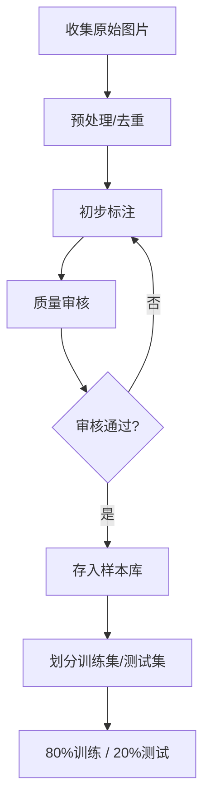
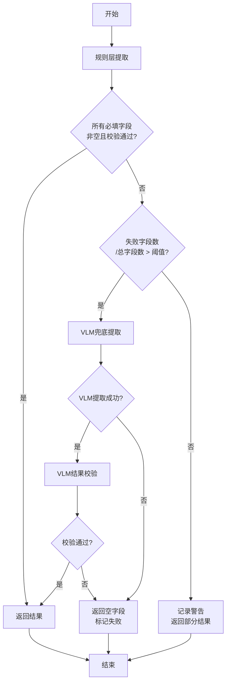

# 快递单识别集成方案

## 1. 概述

### 1.1 背景

当前项目已支持身份证、户口本、结婚证、房产证、购房合同等文档类型的识别，采用三层架构：规则层 → VLM层（LLM层已移除）。分类器使用四阶段路由策略：扩展名 → 规则匹配 → VLM兜底。

本方案旨在将快递单识别能力集成到现有系统中，支持主流快递公司（顺丰、圆通、中通、韵达、EMS等）的运单识别。

### 1.2 目标

- 支持主流快递公司运单的自动分类与字段提取
- 提取关键字段：寄件人、收件人、电话、地址、运单号等
- 保持与现有架构的一致性
- 确保提取准确率达到生产可用水平（>95%）

### 1.3 技术约束

- OCR引擎：PaddleOCR-VL-0.9B / GLM-OCR / Qwen2.5-VL-7B
- VLM模型：Qwen2.5-VL-7B（端口8082）为主，GLM-OCR（端口8080）为辅
- 分类器：基于关键词的规则匹配 + VLM兜底
- 无LLM层（已移除），兜底仅依赖VLM

---

## 2. 样本收集与标注

### 2.1 样本数量建议

| 阶段 | 样本数 | 说明 |
|------|--------|------|
| 初期开发 | 50-100张 | 覆盖3-5家主流快递公司 |
| 模型训练/优化 | 200-300张 | 覆盖8+家公司，包含各种版式 |
| 生产就绪 | 500+张 | 充分覆盖边界情况 |

### 2.2 样本类型分布

```
快递公司分布建议：
├── 顺丰速运 (SF Express)        25%  - 电子面单为主，格式规范
├── 中通快递 (ZTO)               15%  - 传统面单+电子面单
├── 圆通速递 (YTO)               15%  - 传统面单+电子面单
├── 韵达快递 (Yunda)             10%  - 传统面单+电子面单
├── EMS/中国邮政                  10%  - 特殊格式较多
├── 申通快递 (STO)               10%  - 传统面单
├── 极兔速递 (J&T)               10%  - 新兴公司，版式较新
└── 其他 (德邦、京东物流等)       5%   - 补充样本
```

### 2.3 样本质量标准

```
质量要求：
✅ 图像清晰，文字可辨识
✅ 分辨率 >= 300 DPI
✅ 光照均匀，无明显阴影
✅ 拍摄角度 < 15度倾斜
✅ 文件格式：JPG/PNG
✅ 文件大小：500KB - 5MB
```

### 2.4 标注规范

#### 2.4.1 字段定义

| 字段类别 | 字段名 | 说明 | 必填 |
|----------|--------|------|------|
| 基础信息 | 运单号 | 快递单号/追踪号 | ✅ |
| 基础信息 | 快递公司 | SF/中通/圆通等 | ✅ |
| 寄件人 | 寄件人姓名 | 发件人姓名 | ✅ |
| 寄件人 | 寄件人电话 | 发件人联系电话 | ✅ |
| 寄件人 | 寄件人地址 | 发件人详细地址 | ⬜ |
| 寄件人 | 寄件人省市区 | 发件人省市 | ⬜ |
| 收件人 | 收件人姓名 | 收件人姓名 | ✅ |
| 收件人 | 收件人电话 | 收件人联系电话 | ✅ |
| 收件人 | 收件人地址 | 收件人详细地址 | ✅ |
| 收件人 | 收件人省市区 | 收件人省市 | ⬜ |
| 物品信息 | 物品名称 | 包裹内容物 | ⬜ |
| 物品信息 | 重量 | 包裹重量 | ⬜ |
| 物品信息 | 运费 | 运费金额 | ⬜ |
| 其他 | 条形码值 | 一维码内容 | ⬜ |
| 其他 | 二维码值 | 二维码内容 | ⬜ |

#### 2.4.2 标注工具推荐

```
推荐工具：
1. Label Studio (https://labelstud.io/) - 支持OCR标注
2. PPOCRLabel - PaddleOCR官方标注工具
3. DocAnno - 文档标注专用工具
4. 自建JSON标注格式（见下文）
```

#### 2.4.3 标注格式示例

```json
{
  "image_path": "samples/express/sf_001.jpg",
  "doc_type": "EXPRESS_DELIVERY",
  "courier_company": "SF Express",
  "fields": {
    "运单号": "SF1234567890123",
    "寄件人姓名": "张三",
    "寄件人电话": "138****5678",
    "寄件人地址": "北京市朝阳区xx路xx号",
    "收件人姓名": "李四",
    "收件人电话": "139****9012",
    "收件人地址": "上海市浦东新区xx路xx号",
    "物品名称": "文件",
    "重量": "0.5kg"
  },
  "metadata": {
    "annotator": "user001",
    "annotate_date": "2026-07-05",
    "quality": "high"
  }
}
```

### 2.5 标注流程



---

## 3. 快递单字段定义

### 3.1 字段优先级矩阵

| 优先级 | 字段 | 校验规则 | 兜底策略 |
|--------|------|----------|----------|
| P0-必须 | 运单号 | 10-15位数字/字母组合 | VLM重新提取 |
| P0-必须 | 收件人姓名 | 2-10个中文字符 | VLM重新提取 |
| P0-必须 | 收件人电话 | 11位手机号或固话格式 | VLM重新提取 |
| P0-必须 | 收件人地址 | 至少包含省+市 | VLM重新提取 |
| P1-重要 | 寄件人姓名 | 2-10个中文字符 | 允许为空 |
| P1-重要 | 寄件人电话 | 11位手机号或固话格式 | 允许为空 |
| P2-可选 | 寄件人地址 | 地址格式 | 允许为空 |
| P2-可选 | 物品名称 | 文本 | 允许为空 |
| P2-可选 | 重量 | 数字+单位 | 允许为空 |
| P2-可选 | 运费 | 数字格式 | 允许为空 |

### 3.2 字段校验规则

```python
# 校验规则配置（添加到 field_validator.py）
EXPRESS_DELIVERY_RULES = {
    "运单号": {
        "pattern": r"^[A-Za-z0-9]{10,15}$",
        "description": "10-15位字母数字组合",
        "min_len": 10,
        "max_len": 15,
    },
    "收件人姓名": {
        "min_len": 2,
        "max_len": 10,
        "char_type": "chinese_name",
    },
    "收件人电话": {
        "pattern": r"^1[3-9]\d{9}$|^0\d{2,3}-?\d{7,8}$",
        "description": "11位手机号或带区号固话",
    },
    "收件人地址": {
        "min_len": 10,
        "keywords": ["省", "市", "区", "县", "镇", "乡", "路", "号", "街"],
        "min_keywords": 2,
    },
    "寄件人姓名": {
        "min_len": 2,
        "max_len": 10,
        "char_type": "chinese_name",
    },
    "寄件人电话": {
        "pattern": r"^1[3-9]\d{9}$|^0\d{2,3}-?\d{7,8}$",
        "description": "11位手机号或带区号固话",
    },
}
```

---

## 4. OCR层规划

### 4.1 OCR引擎选择

```
当前可用OCR引擎：
├── ppocr (PP-OCRv6)           ✅ 推荐 - 准确率70%，速度41.5秒/张
├── glm_ocr (GLM-OCR)          ⬜ 备选 - 准确率66%，速度27秒/张
├── paddleocr_vl (PaddleOCR-VL) ⬜ 高精度备选 - 速度慢但精度高
└── tiered (分层策略)          ❌ 不推荐 - 测试失败
```

**建议**：复用现有的 `ppocr` 引擎作为主OCR，对于快递单这种半结构化文档，PP-OCRv6已有较好的支持。

### 4.2 快递单特殊处理需求

```
快递单特点：
├── 条形码/一维码  - 需要条码识别能力
├── 二维码        - 需要二维码识别能力
├── 表格结构      - 需要表格理解能力
├── 手写体        - 部分面单有手写签名
└── 热敏纸打印    - 可能存在模糊/褪色
```

#### 4.2.1 条形码/二维码处理

```python
# 建议在 image_preprocessor.py 中增强
import cv2
from pyzbar import zbar

def decode_barcodes(image_path: str) -> Dict[str, str]:
    """解码图片中的条形码和二维码"""
    img = cv2.imread(image_path)
    barcodes = zbar.decode(img)
    
    results = {}
    for barcode in barcodes:
        if barcode.type == 'qrcode':
            results['二维码'] = barcode.data.decode('utf-8')
        elif barcode.type in ('ean13', 'code128', 'code39'):
            results['条形码'] = barcode.data.decode('utf-8')
    
    return results
```

#### 4.2.2 位置标注提取器扩展

```python
# position_extractor.py 需要扩展支持快递单
class ExpressDeliveryPositionExtractor(BasePositionExtractor):
    """快递单位置标注提取器
    
    快递单通常是固定格式的表格布局，可以利用坐标信息进行字段定位。
    """
    
    # 典型快递单的字段区域（归一化坐标）
    FIELD_REGIONS = {
        "运单号": {"x_min": 0.1, "x_max": 0.9, "y_min": 0.05, "y_max": 0.15},
        "寄件人": {"x_min": 0.05, "x_max": 0.5, "y_min": 0.15, "y_max": 0.4},
        "收件人": {"x_min": 0.5, "x_max": 0.95, "y_min": 0.15, "y_max": 0.6},
        "物品信息": {"x_min": 0.05, "x_max": 0.95, "y_min": 0.6, "y_max": 0.8},
    }
```

---

## 5. 分类层规划

### 5.1 DocumentType枚举扩展

```python
# src/ocr_three_layer_hybrid/interfaces.py

class DocumentType(str, Enum):
    """支持的文档类型"""
    
    # ... 现有类型 ...
    
    # 第四类：快递单证（新增）
    EXPRESS_DELIVERY = "快递单"
    EXPRESS_DELIVERY_SF = "快递单-顺丰"
    EXPRESS_DELIVERY_ZTO = "快递单-中通"
    EXPRESS_DELIVERY_YTO = "快递单-圆通"
    EXPRESS_DELIVERY_YUNDA = "快递单-韵达"
    EXPRESS_DELIVERY_EMS = "快递单-EMS"
    EXPRESS_DELIVERY_OTHER = "快递单-其他"
```

### 5.2 页面类型扩展（可选）

```python
# src/ocr_three_layer_hybrid/interfaces.py

class PageType(str, Enum):
    """页面类型"""
    
    # ... 现有类型 ...
    
    # 快递单专用（如有多页需求可扩展）
    EXPRESS_WAYBILL = "运单页"  # 快递运单页面
```

### 5.3 规则匹配策略

```python
# src/ocr_three_layer_hybrid/classifier.py

class KeywordDocumentClassifier(IDocumentClassifier):
    
    # === 阶段2扩展：快递单强信号 ===
    EXPRESS_DELIVERY_SIGNALS: Dict[DocumentType, List[str]] = {
        DocumentType.EXPRESS_DELIVERY: [
            # 通用关键词
            "快递", "运单", "寄件", "收件", "收寄",
            "托寄物", "运费", "签收", "派送",
        ],
    }
    
    # === 快递公司特定信号 ===
    COURIER_COMPANY_SIGNALS: Dict[str, List[str]] = {
        "SF Express": [
            "顺丰速运", "SF Express", "顺丰标快", "顺丰特快",
            "顺丰运单号", "SF"
        ],
        "ZTO": [
            "中通快递", "ZTO", "中通运单",
        ],
        "YTO": [
            "圆通速递", "YTO", "圆通运单",
        ],
        "Yunda": [
            "韵达快递", "韵达速递", "Yunda",
        ],
        "EMS": [
            "EMS", "中国邮政", "邮政快递", "特快专递",
        ],
        "STO": [
            "申通快递", "STO",
        ],
        "J&T": [
            "极兔速递", "J&T", "极兔快递",
        ],
    }
    
    def _check_express_delivery(
        self, image_path: str, full_text: str, ocr_texts: List[str]
    ) -> Optional[DocumentInfo]:
        """
        检查是否为快递单
        """
        # 检查通用快递关键词
        has_express_keyword = any(
            kw in full_text 
            for kw in self.EXPRESS_DELIVERY_SIGNALS.get(DocumentType.EXPRESS_DELIVERY, [])
        )
        
        if not has_express_keyword:
            return None
        
        # 尝试识别具体快递公司
        detected_company = None
        for company, signals in self.COURIER_COMPANY_SIGNALS.items():
            if any(kw in full_text for kw in signals):
                detected_company = company
                break
        
        # 根据是否识别到公司，返回相应类型
        if detected_company:
            # 映射到具体公司类型
            company_doc_type_map = {
                "SF Express": DocumentType.EXPRESS_DELIVERY_SF,
                "ZTO": DocumentType.EXPRESS_DELIVERY_ZTO,
                "YTO": DocumentType.EXPRESS_DELIVERY_YTO,
                "Yunda": DocumentType.EXPRESS_DELIVERY_YUNDA,
                "EMS": DocumentType.EXPRESS_DELIVERY_EMS,
            }
            doc_type = company_doc_type_map.get(detected_company, DocumentType.EXPRESS_DELIVERY)
        else:
            doc_type = DocumentType.EXPRESS_DELIVERY
        
        return DocumentInfo(
            image_path=image_path,
            doc_type=doc_type,
            ocr_texts=ocr_texts,
            confidence=0.85 if detected_company else 0.7,
            metadata={
                "route": "express_delivery_match",
                "courier_company": detected_company or "unknown",
            },
        )
```

### 5.4 VLM分类兜底提示词设计

```python
# src/ocr_three_layer_hybrid/vlm_layer.py

class VLMExtractionLayer(IExtractionLayer):
    
    PROMPT_TEMPLATES: Dict[DocumentType, str] = {
        # ... 现有Prompt ...
        
        DocumentType.EXPRESS_DELIVERY: (
            "你是一名专业的快递运单信息提取专家。请仔细识别图片中的快递单内容，"
            "首先判断快递公司类型，然后提取以下关键字段。\n\n"
            
            "## 任务1：识别快递公司\n"
            "从以下类型中选择：顺丰速运(SF)、中通快递(ZTO)、圆通速递(YTO)、"
            "韵达快递(Yunda)、EMS/中国邮政、申通快递(STO)、极兔速递(J&T)、其他\n\n"
            
            "## 任务2：提取关键字段\n"
            "提取以下字段（如果存在）：\n"
            "- 运单号：快递单号/追踪号，通常为10-15位数字或字母组合\n"
            "- 寄件人信息：姓名、电话、地址\n"
            "- 收件人信息：姓名、电话、地址\n"
            "- 物品信息：名称、重量、数量\n"
            "- 运费：运费金额\n\n"
            
            "## 输出JSON格式（必须严格使用以下键名）\n"
            "{\n"
            '  "快递公司": "",\n'
            '  "运单号": "",\n'
            '  "寄件人姓名": "",\n'
            '  "寄件人电话": "",\n'
            '  "寄件人地址": "",\n'
            '  "收件人姓名": "",\n'
            '  "收件人电话": "",\n'
            '  "收件人地址": "",\n'
            '  "物品名称": "",\n'
            '  "重量": "",\n'
            '  "运费": ""\n'
            "}\n\n"
            
            "## 重要注意事项\n"
            "- 只输出纯JSON，不要包含markdown代码块标记\n"
            "- 不要输出任何其他解释文字\n"
            "- JSON键名必须严格按照上面定义的格式\n"
            "- 如果某个字段在图片中不存在或无法识别，该字段值保留为空字符串\n"
            "- 注意区分寄件人和收件人区域\n"
            "- 电话号码可能包含星号脱敏（如 138****5678）\n"
        ),
        
        DocumentType.EXPRESS_DELIVERY_SF: (
            "你是一名专业的顺丰快递单信息提取专家。请仔细识别图片中的顺丰运单，"
            "提取以下关键字段。\n\n"
            
            "## 输出JSON格式（必须严格使用以下键名）\n"
            "{\n"
            '  "运单号": "",\n'
            '  "寄件人姓名": "",\n'
            '  "寄件人电话": "",\n'
            '  "寄件人地址": "",\n'
            '  "收件人姓名": "",\n'
            '  "收件人电话": "",\n'
            '  "收件人地址": "",\n'
            '  "物品名称": "",\n'
            '  "重量": "",\n'
            '  "运费": "",\n'
            '  "产品类型": "",\n'
            '  "保价金额": ""\n'
            "}\n\n"
            
            "## 顺丰特有字段\n"
            "- 产品类型：顺丰标快、顺丰特快、顺丰即日、顺丰次晨等\n"
            "- 保价金额：声明价值/保价金额\n\n"
            
            "## 重要注意事项\n"
            "- 只输出纯JSON，不要包含markdown代码块标记\n"
            "- 顺丰运单通常有条形码和二维码，优先识别二维码获取运单号\n"
        ),
        
        # 其他快递公司类似...
    }
```

### 5.5 子类型区分

**建议**：初期不需要区分子类型（不同快递公司），统一使用 `EXPRESS_DELIVERY` 即可。原因：

1. 各快递公司的核心字段（寄件人、收件人、运单号）基本一致
2. 差异主要体现在版式和额外字段（如保价、代收货款等）
3. 可以在后续迭代中根据需要逐步细化

如需区分，可在VLM Prompt中让模型先识别快递公司，再使用对应模板。

---

## 6. 数据提取层规划

### 6.1 规则层提取策略

```python
# src/ocr_three_layer_hybrid/extractors/express_delivery_extractor.py
#!/usr/bin/env python3
# -*- coding: utf-8 -*-
"""
快递单提取器
使用正则表达式从快递单中提取字段
"""

import re
from typing import Dict, List, Optional

from .base_extractor import BaseExtractor


class ExpressDeliveryExtractor(BaseExtractor):
    """快递单提取器"""
    
    # 运单号模式（各快递公司）
    WAYBILL_PATTERNS = {
        "SF": r"SF\d{10,12}",
        "ZTO": r"\d{12,15}",
        "YTO": r"[A-Z]\d{9,11}",
        "Yunda": r"\d{12,15}",
        "EMS": r"[A-Z]{2}\d{9,11}[A-Z]{2}",
        "generic": r"[A-Za-z0-9]{10,15}",
    }
    
    # 电话模式
    PHONE_PATTERN = r"1[3-9]\d{9}|0\d{2,3}-?\d{7,8}"
    
    # 地址模式
    ADDRESS_PATTERN = r".*[省市区县镇乡村路街道弄栋幢号].*"
    
    # 字段标签（用于定位）
    FIELD_LABELS = {
        "寄件人": [r"寄(?:件)?人", r"寄方", r"发件人", r"托运人"],
        "收件人": [r"收(?:件)?人", r"收方", r"收货人", r"收件人"],
        "电话": [r"电\s*话", r"联\s*系\s*电\s*话", r"手\s*机", r"Tel"],
        "地址": [r"地\s*址", r"住\s*址", r"Address"],
        "运单号": [r"运单号", r"快递单号", r"追踪号", r"Waybill", r"Tracking"],
    }
    
    def extract(self, text: str, key_list: List[str]) -> Dict[str, str]:
        """
        从快递单文本中提取字段
        
        Args:
            text: OCR处理后的文本
            key_list: 需要提取的字段列表
            
        Returns:
            提取的字段字典
        """
        fields = {k: "" for k in key_list}
        
        # 1. 提取运单号
        if "运单号" in key_list:
            fields["运单号"] = self._extract_waybill_number(text)
        
        # 2. 提取寄件人信息
        sender_region = self._find_sender_region(text)
        if sender_region and "寄件人姓名" in key_list:
            fields["寄件人姓名"] = self._extract_name(sender_region)
        if sender_region and "寄件人电话" in key_list:
            fields["寄件人电话"] = self._extract_phone(sender_region)
        if sender_region and "寄件人地址" in key_list:
            fields["寄件人地址"] = self._extract_address(sender_region)
        
        # 3. 提取收件人信息
        receiver_region = self._find_receiver_region(text)
        if receiver_region and "收件人姓名" in key_list:
            fields["收件人姓名"] = self._extract_name(receiver_region)
        if receiver_region and "收件人电话" in key_list:
            fields["收件人电话"] = self._extract_phone(receiver_region)
        if receiver_region and "收件人地址" in key_list:
            fields["收件人地址"] = self._extract_address(receiver_region)
        
        return fields
    
    def _extract_waybill_number(self, text: str) -> str:
        """提取运单号"""
        # 尝试各快递公司的模式
        for pattern in self.WAYBILL_PATTERNS.values():
            match = re.search(pattern, text)
            if match:
                return match.group()
        return ""
    
    def _find_sender_region(self, text: str) -> Optional[str]:
        """查找寄件人区域文本"""
        for label_pattern in self.FIELD_LABELS["寄件人"]:
            match = re.search(label_pattern, text)
            if match:
                start = match.end()
                # 向后取一定范围的文本作为区域
                end = min(start + 200, len(text))
                return text[start:end]
        return None
    
    def _find_receiver_region(self, text: str) -> Optional[str]:
        """查找收件人区域文本"""
        for label_pattern in self.FIELD_LABELS["收件人"]:
            match = re.search(label_pattern, text)
            if match:
                start = match.end()
                end = min(start + 200, len(text))
                return text[start:end]
        return None
    
    def _extract_name(self, region: str) -> str:
        """提取姓名"""
        # 简单实现：提取第一个中文字符串
        match = re.search(r"[一-鿿]{2,5}", region)
        return match.group() if match else ""
    
    def _extract_phone(self, region: str) -> str:
        """提取电话"""
        match = re.search(self.PHONE_PATTERN, region)
        return match.group() if match else ""
    
    def _extract_address(self, region: str) -> str:
        """提取地址"""
        lines = region.split('\n')
        for line in lines:
            if re.search(self.ADDRESS_PATTERN, line):
                return line.strip()
        return ""
```

### 6.2 VLM层提取策略

VLM层用于处理以下场景：
1. 规则层提取失败（字段为空或校验失败）
2. 复杂版式的快递单（非标准布局）
3. 手写体识别

```python
# 在 vlm_layer.py 中添加快递单专用Prompt
# （见5.4节）
```

### 6.3 LLM层恢复方案（可选）

**当前状态**：LLM层已移除，不再提供三级兜底。

**如需恢复LLM层**，可按以下步骤操作：

```python
# 1. 在 interfaces.py 中确认 ProcessingLayer.LLM 仍存在
# 2. 创建 llm_layer.py
# 3. 在 pipeline.py 中添加LLM层的调用逻辑
# 4. 配置LLM服务（可使用本地Qwen3.5-4B或云端API）

# llm_layer.py 示例框架
class LLMExtractionLayer(IExtractionLayer):
    """LLM提取层（兜底）
    
    使用纯文本LLM对规则层和VLM层都无法处理的场景进行兜底提取。
    输入：OCR文本 + 上下文
    输出：结构化字段
    """
    
    def __init__(self, model_name: str = "qwen3.5-4b"):
        self.model_name = model_name
        # 初始化LLM客户端
    
    def extract(self, doc_info: DocumentInfo, key_list: List[str]) -> ExtractionResult:
        # 构建Prompt：基于OCR文本提取字段
        # 调用LLM API
        # 解析响应
        pass
```

**评估**：对于快递单场景，VLM已经能够处理绝大多数情况，LLM层的ROI较低，**建议暂不恢复**。

---

## 7. 兜底机制

### 7.1 整体兜底流程



### 7.2 兜底触发条件

```python
# 配置项（config.py）
@dataclass
class FallbackConfig:
    """兜底机制配置"""
    
    # 字段缺失比例阈值（超过此比例触发VLM兜底）
    missing_field_ratio: float = 0.3  # 30%
    
    # 必填字段列表（任一缺失即触发兜底）
    required_fields: List[str] = field(default_factory=lambda: [
        "运单号",
        "收件人姓名",
        "收件人电话",
        "收件人地址",
    ])
    
    # 置信度阈值（低于此值触发VLM兜底）
    confidence_threshold: float = 0.6
    
    # 最大重试次数
    max_vlm_retries: int = 2
```

### 7.3 兜底实现

```python
# 在 rule_layer.py 或 pipeline.py 中
def extract_with_fallback(
    doc_info: DocumentInfo, 
    key_list: List[str],
    validator: FieldValidator,
    vlm_layer: VLMExtractionLayer,
    config: FallbackConfig,
) -> ExtractionResult:
    """
    带兜底机制的字段提取
    """
    # 1. 规则层提取
    rule_result = rule_layer.extract(doc_info, key_list)
    
    # 2. 校验字段
    failed_fields = validator.get_failed_fields(rule_result.fields)
    missing_fields = [k for k in key_list if not rule_result.fields.get(k)]
    
    # 3. 判断是否需要兜底
    needs_fallback = False
    
    # 检查必填字段
    for field in config.required_fields:
        if field in missing_fields or field in failed_fields:
            needs_fallback = True
            break
    
    # 检查缺失比例
    total_problematic = len(set(missing_fields) | set(failed_fields))
    if total_problematic / len(key_list) > config.missing_field_ratio:
        needs_fallback = True
    
    # 4. VLM兜底
    if needs_fallback:
        logger.info(
            f"[兜底] 触发VLM兜底 | 缺失: {missing_fields} | 失败: {failed_fields}"
        )
        vlm_result = vlm_layer.extract(doc_info, key_list)
        
        # 合并结果（VLM结果优先）
        merged_fields = {**rule_result.fields, **vlm_result.fields}
        rule_result.fields = merged_fields
        rule_result.vlm_fallback_triggered = True
        rule_result.vlm_fallback_fields = list(set(missing_fields + failed_fields))
    
    return rule_result
```

---

## 8. 代码修改清单

### 8.1 需要修改的文件

| 文件路径 | 修改类型 | 修改内容 |
|----------|----------|----------|
| `src/ocr_three_layer_hybrid/interfaces.py` | 修改 | 添加 `EXPRESS_DELIVERY` 及相关枚举值 |
| `src/ocr_three_layer_hybrid/config.py` | 修改 | 添加快递单相关配置项 |
| `src/ocr_three_layer_hybrid/classifier.py` | 修改 | 添加快递单分类规则和 `_check_express_delivery` 方法 |
| `src/ocr_three_layer_hybrid/vlm_layer.py` | 修改 | 添加快递单专用Prompt模板 |
| `src/ocr_three_layer_hybrid/field_validator.py` | 修改 | 添加快递单字段校验规则 |
| `src/ocr_three_layer_hybrid/rule_layer.py` | 修改 | 注册快递单提取器 |
| `src/ocr_three_layer_hybrid/extractors/__init__.py` | 修改 | 导出新的提取器 |

### 8.2 需要新增的文件

| 文件路径 | 说明 |
|----------|------|
| `src/ocr_three_layer_hybrid/extractors/express_delivery_extractor.py` | 快递单规则提取器 |
| `tests/unit/test_express_delivery_extractor.py` | 快递单提取器单元测试 |
| `tests/integration/test_express_delivery_pipeline.py` | 快递单端到端测试 |

### 8.3 详细修改内容

#### 8.3.1 interfaces.py

```python
# 在 DocumentType 枚举中添加（约第68行后）
class DocumentType(str, Enum):
    """支持的文档类型"""
    
    # ... 现有类型 ...
    
    # 第四类：快递单证（新增）
    EXPRESS_DELIVERY = "快递单"
    EXPRESS_DELIVERY_SF = "快递单-顺丰"
    EXPRESS_DELIVERY_ZTO = "快递单-中通"
    EXPRESS_DELIVERY_YTO = "快递单-圆通"
    EXPRESS_DELIVERY_YUNDA = "快递单-韵达"
    EXPRESS_DELIVERY_EMS = "快递单-EMS"
    EXPRESS_DELIVERY_OTHER = "快递单-其他"
```

#### 8.3.2 classifier.py

```python
# 在 STANDARD_DOCUMENT_SIGNALS 后添加（约第138行后）

# === 阶段2扩展：快递单强信号 ===
EXPRESS_DELIVERY_SIGNALS: Dict[DocumentType, List[str]] = {
    DocumentType.EXPRESS_DELIVERY: [
        "快递", "运单", "寄件", "收件", "收寄",
        "托寄物", "运费", "签收", "派送",
    ],
}

# 快递公司特定信号
COURIER_COMPANY_SIGNALS: Dict[str, List[str]] = {
    "SF Express": ["顺丰速运", "SF Express", "顺丰标快"],
    "ZTO": ["中通快递", "ZTO"],
    "YTO": ["圆通速递", "YTO"],
    "Yunda": ["韵达快递", "韵达速递"],
    "EMS": ["EMS", "中国邮政"],
    "STO": ["申通快递", "STO"],
    "J&T": ["极兔速递", "J&T"],
}

# 在 _check_standard_documents 方法后添加 _check_express_delivery 方法
def _check_express_delivery(
    self, image_path: str, full_text: str, ocr_texts: List[str]
) -> Optional[DocumentInfo]:
    """检查是否为快递单"""
    has_express_keyword = any(
        kw in full_text 
        for kw in self.EXPRESS_DELIVERY_SIGNALS.get(DocumentType.EXPRESS_DELIVERY, [])
    )
    
    if not has_express_keyword:
        return None
    
    # 尝试识别具体快递公司
    detected_company = None
    for company, signals in self.COURIER_COMPANY_SIGNALS.items():
        if any(kw in full_text for kw in signals):
            detected_company = company
            break
    
    # 返回结果
    company_doc_type_map = {
        "SF Express": DocumentType.EXPRESS_DELIVERY_SF,
        "ZTO": DocumentType.EXPRESS_DELIVERY_ZTO,
        "YTO": DocumentType.EXPRESS_DELIVERY_YTO,
        "Yunda": DocumentType.EXPRESS_DELIVERY_YUNDA,
        "EMS": DocumentType.EXPRESS_DELIVERY_EMS,
    }
    doc_type = company_doc_type_map.get(detected_company, DocumentType.EXPRESS_DELIVERY)
    
    return DocumentInfo(
        image_path=image_path,
        doc_type=doc_type,
        ocr_texts=ocr_texts,
        confidence=0.85 if detected_company else 0.7,
        metadata={
            "route": "express_delivery_match",
            "courier_company": detected_company or "unknown",
        },
    )

# 在 classify_base 方法的阶段2后添加调用
# 在 _check_standard_documents 后添加：
result = self._check_express_delivery(image_path, full_text, ocr_texts)
if result:
    return result
```

#### 8.3.3 express_delivery_extractor.py（新文件）

```python
#!/usr/bin/env python3
# -*- coding: utf-8 -*-
"""
快递单提取器
使用正则表达式从快递单中提取字段
"""

import re
from typing import Dict, List, Optional

from .base_extractor import BaseExtractor


class ExpressDeliveryExtractor(BaseExtractor):
    """快递单提取器"""
    
    # 运单号模式（各快递公司）
    WAYBILL_PATTERNS = {
        "SF": r"SF\d{10,12}",
        "ZTO": r"\d{12,15}",
        "YTO": r"[A-Z]\d{9,11}",
        "Yunda": r"\d{12,15}",
        "EMS": r"[A-Z]{2}\d{9,11}[A-Z]{2}",
        "generic": r"[A-Za-z0-9]{10,15}",
    }
    
    # 电话模式
    PHONE_PATTERN = r"1[3-9]\d{9}|0\d{2,3}-?\d{7,8}"
    
    # 地址模式
    ADDRESS_PATTERN = r".*[省市区县镇乡村路街道弄栋幢号].*"
    
    # 字段标签（用于定位）
    FIELD_LABELS = {
        "寄件人": [r"寄(?:件)?人", r"寄方", r"发件人", r"托运人"],
        "收件人": [r"收(?:件)?人", r"收方", r"收货人", r"收件人"],
        "电话": [r"电\s*话", r"联\s*系\s*电\s*话", r"手\s*机", r"Tel"],
        "地址": [r"地\s*址", r"住\s*址", r"Address"],
        "运单号": [r"运单号", r"快递单号", r"追踪号", r"Waybill", r"Tracking"],
    }
    
    def extract(self, text: str, key_list: List[str]) -> Dict[str, str]:
        """
        从快递单文本中提取字段
        
        Args:
            text: OCR处理后的文本
            key_list: 需要提取的字段列表
            
        Returns:
            提取的字段字典
        """
        fields = {k: "" for k in key_list}
        
        # 1. 提取运单号
        if "运单号" in key_list:
            fields["运单号"] = self._extract_waybill_number(text)
        
        # 2. 提取寄件人信息
        sender_region = self._find_sender_region(text)
        if sender_region:
            if "寄件人姓名" in key_list:
                fields["寄件人姓名"] = self._extract_name(sender_region)
            if "寄件人电话" in key_list:
                fields["寄件人电话"] = self._extract_phone(sender_region)
            if "寄件人地址" in key_list:
                fields["寄件人地址"] = self._extract_address(sender_region)
        
        # 3. 提取收件人信息
        receiver_region = self._find_receiver_region(text)
        if receiver_region:
            if "收件人姓名" in key_list:
                fields["收件人姓名"] = self._extract_name(receiver_region)
            if "收件人电话" in key_list:
                fields["收件人电话"] = self._extract_phone(receiver_region)
            if "收件人地址" in key_list:
                fields["收件人地址"] = self._extract_address(receiver_region)
        
        # 4. 提取其他字段
        if "物品名称" in key_list:
            fields["物品名称"] = self._extract_item_name(text)
        if "重量" in key_list:
            fields["重量"] = self._extract_weight(text)
        
        return fields
    
    def _extract_waybill_number(self, text: str) -> str:
        """提取运单号"""
        for pattern in self.WAYBILL_PATTERNS.values():
            match = re.search(pattern, text)
            if match:
                return match.group()
        return ""
    
    def _find_sender_region(self, text: str) -> Optional[str]:
        """查找寄件人区域文本"""
        for label_pattern in self.FIELD_LABELS["寄件人"]:
            match = re.search(label_pattern, text, re.IGNORECASE)
            if match:
                start = match.end()
                end = min(start + 200, len(text))
                return text[start:end]
        return None
    
    def _find_receiver_region(self, text: str) -> Optional[str]:
        """查找收件人区域文本"""
        for label_pattern in self.FIELD_LABELS["收件人"]:
            match = re.search(label_pattern, text, re.IGNORECASE)
            if match:
                start = match.end()
                end = min(start + 200, len(text))
                return text[start:end]
        return None
    
    def _extract_name(self, region: str) -> str:
        """提取姓名"""
        match = re.search(r"[一-鿿]{2,5}", region)
        return match.group() if match else ""
    
    def _extract_phone(self, region: str) -> str:
        """提取电话"""
        match = re.search(self.PHONE_PATTERN, region)
        return match.group() if match else ""
    
    def _extract_address(self, region: str) -> str:
        """提取地址"""
        lines = region.split('\n')
        for line in lines:
            if re.search(self.ADDRESS_PATTERN, line):
                return line.strip()
        return ""
    
    def _extract_item_name(self, text: str) -> str:
        """提取物品名称"""
        patterns = [r"物品[：:]?\s*([^\n]+)", r"托寄物[：:]?\s*([^\n]+)"]
        for pattern in patterns:
            match = re.search(pattern, text)
            if match:
                return match.group(1).strip()
        return ""
    
    def _extract_weight(self, text: str) -> str:
        """提取重量"""
        match = re.search(r"([\d.]+\s*(?:kg|公斤|克|g))", text, re.IGNORECASE)
        return match.group(1) if match else ""
```

#### 8.3.4 extractors/__init__.py

```python
# 添加导出
from .express_delivery_extractor import ExpressDeliveryExtractor

__all__ = [
    "PersonalIdExtractor",
    "HouseholdPropertyExtractor",
    "FinancialExtractor",
    "AgreementExtractor",
    "ExpressDeliveryExtractor",  # 新增
]
```

#### 8.3.5 rule_layer.py

```python
# 在导入中添加
from ocr_three_layer_hybrid.extractors import (
    PersonalIdExtractor,
    HouseholdPropertyExtractor,
    FinancialExtractor,
    AgreementExtractor,
    ExpressDeliveryExtractor,  # 新增
)

# 在 __init__ 中初始化
class RuleExtractionLayer(IExtractionLayer):
    def __init__(self, position_extractor=None):
        self._position_extractor = position_extractor
        self._personal_id_extractor = PersonalIdExtractor()
        self._household_property_extractor = HouseholdPropertyExtractor()
        self._financial_extractor = FinancialExtractor()
        self._agreement_extractor = AgreementExtractor()
        self._express_delivery_extractor = ExpressDeliveryExtractor()  # 新增

    @property
    def supported_doc_types(self) -> List[DocumentType]:
        return [
            # ... 现有类型 ...
            DocumentType.EXPRESS_DELIVERY,
            DocumentType.EXPRESS_DELIVERY_SF,
            DocumentType.EXPRESS_DELIVERY_ZTO,
            DocumentType.EXPRESS_DELIVERY_YTO,
            DocumentType.EXPRESS_DELIVERY_YUNDA,
            DocumentType.EXPRESS_DELIVERY_EMS,
            DocumentType.EXPRESS_DELIVERY_OTHER,
        ]

    def extract(self, doc_info: DocumentInfo, key_list: List[str]) -> ExtractionResult:
        # ... 现有逻辑 ...
        
        # 添加快递单处理
        elif doc_info.doc_type in [
            DocumentType.EXPRESS_DELIVERY,
            DocumentType.EXPRESS_DELIVERY_SF,
            DocumentType.EXPRESS_DELIVERY_ZTO,
            DocumentType.EXPRESS_DELIVERY_YTO,
            DocumentType.EXPRESS_DELIVERY_YUNDA,
            DocumentType.EXPRESS_DELIVERY_EMS,
            DocumentType.EXPRESS_DELIVERY_OTHER,
        ]:
            fields = self._express_delivery_extractor.extract(full_text, key_list)
        
        # ... 后续逻辑不变 ...
```

#### 8.3.6 field_validator.py

```python
# 在 VALIDATION_RULES 中添加
VALIDATION_RULES: Dict[str, Dict] = {
    # ... 现有规则 ...
    
    # 快递单字段
    "运单号": {
        "pattern": r"^[A-Za-z0-9]{10,15}$",
        "description": "10-15位字母数字组合",
        "min_len": 10,
        "max_len": 15,
    },
    "收件人姓名": {
        "min_len": 2,
        "max_len": 10,
        "char_type": "chinese_name",
    },
    "收件人电话": {
        "pattern": r"^1[3-9]\d{9}$|^0\d{2,3}-?\d{7,8}$",
        "description": "11位手机号或带区号固话",
    },
    "收件人地址": {
        "min_len": 10,
        "description": "至少10个字符的地址",
    },
    "寄件人姓名": {
        "min_len": 2,
        "max_len": 10,
        "char_type": "chinese_name",
    },
    "寄件人电话": {
        "pattern": r"^1[3-9]\d{9}$|^0\d{2,3}-?\d{7,8}$",
        "description": "11位手机号或带区号固话",
    },
}
```

#### 8.3.7 config.py

```python
# 在 ThresholdsConfig 中添加（可选）
@dataclass
class ThresholdsConfig:
    # ... 现有配置 ...
    
    # 快递单相关
    express_delivery_confidence_threshold: float = 0.7  # 快递单分类置信度阈值
    express_delivery_missing_field_ratio: float = 0.3  # 触发VLM兜底的缺失比例
```

---

## 9. 测试计划

### 9.1 单元测试

```python
# tests/unit/test_express_delivery_extractor.py
import pytest
from ocr_three_layer_hybrid.extractors import ExpressDeliveryExtractor


class TestExpressDeliveryExtractor:
    
    def setup_method(self):
        self.extractor = ExpressDeliveryExtractor()
    
    def test_extract_waybill_number_sf(self):
        """测试顺丰运单号提取"""
        text = "顺丰速运 运单号：SF1234567890123"
        result = self.extractor._extract_waybill_number(text)
        assert result == "SF1234567890123"
    
    def test_extract_waybill_number_generic(self):
        """测试通用运单号提取"""
        text = "快递单号：123456789012"
        result = self.extractor._extract_waybill_number(text)
        assert len(result) == 12
    
    def test_extract_phone(self):
        """测试电话提取"""
        region = "电话：13812345678"
        result = self.extractor._extract_phone(region)
        assert result == "13812345678"
    
    def test_extract_address(self):
        """测试地址提取"""
        region = "地址：北京市朝阳区建国路100号"
        result = self.extractor._extract_address(region)
        assert "北京市" in result and "朝阳区" in result
    
    def test_extract_sender_info(self):
        """测试寄件人信息提取"""
        text = """
        寄件人：张三
        电话：13812345678
        地址：北京市海淀区中关村大街1号
        """
        sender = self.extractor._find_sender_region(text)
        assert sender is not None
        name = self.extractor._extract_name(sender)
        assert name == "张三"
    
    def test_extract_receiver_info(self):
        """测试收件人信息提取"""
        text = """
        收件人：李四
        电话：13987654321
        地址：上海市浦东新区陆家嘴环路1000号
        """
        receiver = self.extractor._find_receiver_region(text)
        assert receiver is not None
        name = self.extractor._extract_name(receiver)
        assert name == "李四"
    
    def test_extract_all_fields(self):
        """测试完整字段提取"""
        text = """
        顺丰速运
        运单号：SF1234567890123
        
        寄件人：张三
        电话：13812345678
        地址：北京市海淀区中关村大街1号
        
        收件人：李四
        电话：13987654321
        地址：上海市浦东新区陆家嘴环路1000号
        
        物品：文件
        重量：0.5kg
        """
        key_list = [
            "运单号", "寄件人姓名", "寄件人电话", "寄件人地址",
            "收件人姓名", "收件人电话", "收件人地址",
            "物品名称", "重量"
        ]
        result = self.extractor.extract(text, key_list)
        
        assert result["运单号"] == "SF1234567890123"
        assert result["寄件人姓名"] == "张三"
        assert result["收件人姓名"] == "李四"
        assert "海淀" in result["寄件人地址"]
        assert "浦东" in result["收件人地址"]
```

### 9.2 集成测试

```python
# tests/integration/test_express_delivery_pipeline.py
import pytest
from pathlib import Path
from ocr_three_layer_hybrid.service import OCRService
from ocr_three_layer_hybrid.interfaces import DocumentType


class TestExpressDeliveryPipeline:
    
    def setup_method(self):
        self.service = OCRService()
        self.test_dir = Path(__file__).parent.parent / "test_data" / "express_delivery"
    
    @pytest.mark.parametrize("sample_file", [
        "sf_sample_001.jpg",
        "zto_sample_001.jpg",
        "yto_sample_001.jpg",
    ])
    def test_express_delivery_classification(self, sample_file):
        """测试快递单分类"""
        image_path = str(self.test_dir / sample_file)
        if not Path(image_path).exists():
            pytest.skip(f"测试文件不存在: {image_path}")
        
        result = self.service.process(image_path, key_list=[
            "运单号", "寄件人姓名", "收件人姓名"
        ])
        
        assert result.doc_type in [
            DocumentType.EXPRESS_DELIVERY,
            DocumentType.EXPRESS_DELIVERY_SF,
            DocumentType.EXPRESS_DELIVERY_ZTO,
            DocumentType.EXPRESS_DELIVERY_YTO,
        ]
    
    @pytest.mark.parametrize("sample_file", [
        "sf_sample_001.jpg",
        "zto_sample_001.jpg",
    ])
    def test_express_delivery_extraction(self, sample_file):
        """测试快递单字段提取"""
        image_path = str(self.test_dir / sample_file)
        if not Path(image_path).exists():
            pytest.skip(f"测试文件不存在: {image_path}")
        
        key_list = [
            "运单号", "寄件人姓名", "寄件人电话",
            "收件人姓名", "收件人电话", "收件人地址"
        ]
        result = self.service.process(image_path, key_list=key_list)
        
        assert result.success
        assert result.fields.get("运单号") != ""
        assert result.fields.get("收件人姓名") != ""
        assert result.fields.get("收件人电话") != ""
```

### 9.3 性能测试

```python
# tests/performance/test_express_delivery_performance.py
import time
import pytest
from ocr_three_layer_hybrid.service import OCRService


class TestExpressDeliveryPerformance:
    
    def test_single_image_processing_time(self):
        """测试单张图片处理时间"""
        service = OCRService()
        image_path = "tests/test_data/express_delivery/sf_sample_001.jpg"
        
        start_time = time.time()
        result = service.process(image_path, key_list=["运单号", "收件人姓名"])
        elapsed = time.time() - start_time
        
        assert elapsed < 30  # 单张处理应在30秒内完成
        assert result.success
    
    def test_batch_processing_throughput(self):
        """测试批量处理吞吐量"""
        service = OCRService()
        image_paths = [
            f"tests/test_data/express_delivery/sample_{i}.jpg"
            for i in range(10)
        ]
        image_paths = [p for p in image_paths if Path(p).exists()]
        
        if not image_paths:
            pytest.skip("无测试文件")
        
        start_time = time.time()
        for image_path in image_paths:
            service.process(image_path, key_list=["运单号"])
        elapsed = time.time() - start_time
        
        avg_time_per_image = elapsed / len(image_paths)
        assert avg_time_per_image < 30  # 平均每张应在30秒内
```

### 9.4 测试数据准备

```bash
# 创建测试数据目录
mkdir -p tests/test_data/express_delivery

# 放置测试样本（可从实际收集的样本中选取）
# 至少包含：
# - 每家快递公司 3-5 张清晰样本
# - 每家快递公司 1-2 张模糊/倾斜/低质量样本
# - 不同版式（电子面单、传统面单）
```

---

## 10. 实施路线图

### 10.1 分阶段实施计划

```
Phase 1: 基础集成（1周）
├── Day 1-2: 样本收集与标注（50张）
├── Day 3: 代码修改（枚举、分类器、提取器）
├── Day 4: 单元测试编写
└── Day 5: 集成测试与调试

Phase 2: 优化与验证（1周）
├── Day 1-2: 扩大样本集（200张）
├── Day 3: Prompt优化（针对识别率低的场景）
├── Day 4: 规则提取器优化
└── Day 5: 端到端测试与验收

Phase 3: 生产准备（1周）
├── Day 1-2: 性能测试与优化
├── Day 3: 兜底机制完善
├── Day 4: 文档完善
└── Day 5: Code Review & 上线准备
```

### 10.2 每阶段交付物

| 阶段 | 交付物 |
|------|--------|
| Phase 1 | 可运行的基础版本、单元测试报告、50张标注样本 |
| Phase 2 | 优化后的版本、200张标注样本、准确率报告 |
| Phase 3 | 生产就绪版本、性能测试报告、完整文档 |

### 10.3 时间估算

| 任务 | 工时 |
|------|------|
| 样本收集与标注（50张） | 2天 |
| 代码修改（枚举、分类器、提取器） | 2天 |
| VLM Prompt设计与调优 | 1天 |
| 单元测试编写 | 1天 |
| 集成测试与调试 | 2天 |
| 样本扩充（200张） | 3天 |
| Prompt优化 | 2天 |
| 性能测试与优化 | 2天 |
| 文档完善 | 1天 |
| Code Review | 1天 |
| **总计** | **17天** ≈ **3.5周** |

---

## 11. 风险评估

### 11.1 技术风险

| 风险 | 概率 | 影响 | 缓解措施 |
|------|------|------|----------|
| OCR对热敏纸识别率低 | 中 | 高 | 图像预处理增强；VLM兜底 |
| 快递单版式多样，规则提取困难 | 中 | 中 | 依赖VLM为主要提取手段 |
| 条形码/二维码识别失败 | 低 | 中 | 集成专用条码识别库（pyzbar） |
| VLM响应不稳定 | 低 | 中 | Prompt固化；增加few-shot示例 |

### 11.2 数据风险

| 风险 | 概率 | 影响 | 缓解措施 |
|------|------|------|----------|
| 样本不足导致泛化能力差 | 中 | 高 | 持续收集样本；数据增强 |
| 隐私泄露（真实快递单含个人信息） | 高 | 高 | 数据脱敏；匿名化处理 |
| 标注错误导致训练偏差 | 中 | 中 | 双人标注+交叉审核 |

### 11.3 性能风险

| 风险 | 概率 | 影响 | 缓解措施 |
|------|------|------|----------|
| 处理速度慢（VLM耗时） | 中 | 中 | 异步处理；缓存机制 |
| 内存占用高（大图处理） | 低 | 中 | 图像压缩；分页处理 |

### 11.4 风险矩阵

```
                 影响
              低     中     高
概率  高      │      │   [数据隐私]
      中   [样本] [版式] [OCR识别]
      低   [条码] [内存] [VLM稳定]
```

---

## 12. 附录

### 12.1 快递公司运单号规则

| 快递公司 | 运单号格式 | 示例 |
|----------|-----------|------|
| 顺丰速运 | SF + 10-12位数字 | SF1234567890123 |
| 中通快递 | 12-15位数字 | 7890123456789 |
| 圆通速递 | 字母 + 9-11位数字 | YT1234567890 |
| 韵达快递 | 12-15位数字 | 1234567890123 |
| EMS | 2字母 + 9-11数字 + 2字母 | EA123456789CN |
| 申通快递 | 12-15位数字 | 1234567890123 |
| 极兔速递 | 12-15位数字 | 1234567890123 |

### 12.2 快递单典型版式参考

```
┌─────────────────────────────────────────┐
│  [快递公司Logo]         [条形码/二维码]  │
│                          运单号：XXX     │
├─────────────────────┬───────────────────┤
│  寄件人             │  收件人           │
│  姓名：XXX          │  姓名：XXX        │
│  电话：XXX          │  电话：XXX        │
│  地址：XXX          │  地址：XXX        │
├─────────────────────┴───────────────────┤
│  物品信息                                │
│  名称：XXX    重量：XXX    运费：XXX     │
└─────────────────────────────────────────┘
```

### 12.3 术语表

| 术语 | 说明 |
|------|------|
| 运单号 | Waybill Number / Tracking Number，快递唯一标识 |
| 电子面单 | 热敏打印的标准格式面单，含条形码/二维码 |
| 传统面单 | 多联复写纸质面单，需手写或针式打印 |
| VLM | Vision-Language Model，视觉语言模型 |
| OCR | Optical Character Recognition，光学字符识别 |

---

## 13. 参考资料

1. PaddleOCR: https://github.com/PaddlePaddle/PaddleOCR
2. Qwen2.5-VL: https://qwen.readthedocs.io/
3. GLM-OCR: https://github.com/THUDM/GLM-4V
4. 快递鸟API文档: https://www.kdniao.com/
5. 快递单国家标准: GB/T 27917-2011
